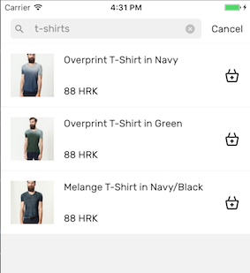
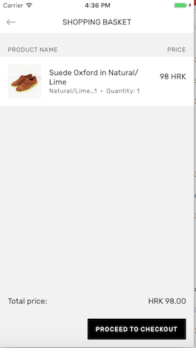
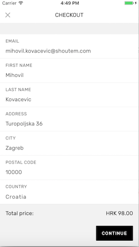
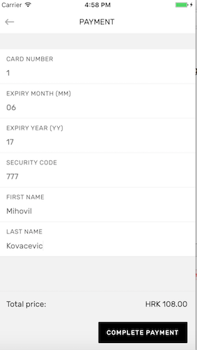

# react-native-shopify

## Getting started

`$ npm install react-native-shopify --save`

### Including Mobile-BUY-SDK

Include the Shopify Mobile Buy SDK in your project to make it available to the bridge.
Follow the instructions on their Github page to get started. For example,
the recommended and easiest way for iOS is to install it as a Pod. This project will look
for headers in the Pods directory.

### Mostly automatic installation

`$ react-native link react-native-shopify`

### Manual installation


#### iOS

1. In XCode, in the project navigator, right click `Libraries` ➜ `Add Files to [your project's name]`
2. Go to `node_modules` ➜ `react-native-shopify` and add `RNShopify.xcodeproj`
3. In XCode, in the project navigator, select your project. Add `libRNShopify.a` to your project's `Build Phases` ➜ `Link Binary With Libraries`
4. Run your project (`Cmd+R`)<

#### Android

1. Open up `android/app/src/main/java/[...]/MainActivity.java`
  - Add `import com.reactnativeshopify.RNShopifyPackage;` to the imports at the top of the file
  - Add `new RNShopifyPackage()` to the list returned by the `getPackages()` method
2. Append the following lines to `android/settings.gradle`:
      ```
      include ':react-native-shopify'
      project(':react-native-shopify').projectDir = new File(rootProject.projectDir, 	'../node_modules/react-native-shopify/android')
      ```
3. Insert the following lines inside the dependencies block in `android/app/build.gradle`:
      ```
      compile project(':react-native-shopify')
      ```


## Usage

### Initialize the shop.

```javascript
import Shopify from 'react-native-shopify';

Shopify.initialize('yourshopifystore.myshopify.com', 'YOUR API KEY');

```

### Fetch shop data, collections and tags

```javascript

Shopify.getShop().then(shop => {
  // Save the shop somewhere and use it to display currency and other info
  return getAllCollections();
}).then(collections => {
  // Do something with collections
  return getAllTags();
}).then(tags => {
  // And tags...
});

// You shoud load collections and tags from Shopify recursively since each query is
// limited to 25 results by the SDK. Here are some methods to help you out:

const getAllCollections = (page = 1, allCollections = []) =>
  Shopify.getCollections(page).then((collections) => {
    if (_.size(collections)) {
      return getAllCollections(page + 1, [...allCollections, ...collections]);
    }
    return allCollections;
  });

// The same goes for tags...

const getAllTags = (page = 1, allTags = []) =>
  Shopify.getProductTags(page).then((tags) => {
    if (_.size(tags)) {
      return getAllTags(page + 1, [...allTags, ...tags]);
    }
    return allTags;
  });

// At last, fetch the first page (25) of products:

Shopify.getProducts().then(products => {
  // Show products to your users
});

// You can also fetch products for a specific page and collection ID

Shopify.getProducts(2, collectionId).then(products => {});

```


### Search products by tags

```javascript

Shopify.getProducts(1, collectionId, ['t-shirts']).then(products => {});

```



### Add products to cart and proceed to checkout

A product has several variants. For example, a sweater in various sizes and colors. You add
variants for products to the cart. A cart item is defined as a tuple of _item_, _variant_ and _quantity_.

You can perform a native or web checkout. Contributions for Apple Pay are welcome! The steps below
describe the native checkout flow.

#### Add item to cart


#### Proceed to checkout



```javascript

// Add the first variant of the first fetched product, times 2:
Shopify.getProducts().then(products => {
  const firstProduct = products[0];

  // Note that you should set product and variant objects, not IDs.
  // Also note that the key for product is item
  const cartItem = {
    item: firstProduct,
    variant: firstProduct.variants[0],
    quantity: 2,
  };

  const cart = [cartItem];

  // Pass a clone of your cart because the SDK will mutate it
  Shopify.checkout(_.cloneDeep(cart)).then(() => {
    // We're ready to collect customer information
  }).catch((error) => {
    // You'll get a user friendly message here informing you exactly
    // what's wrong with the checkout and which items are not available.
    // The bridge parses native errors and constructs this message.
    Alert.alert(
      'Error with checkout',
      error.message,
    );
  });
});

```

### Collect customer information



```javascript

const email = 'customer@mycustomer.com';

const addressInformation = {
  // Use the same properties as described in Shopify's iOS and Android SDK documentation
};

Shopify.setCustomerInformation(email, addressInformation).then(() => {
  // Fetch shipping rates
  return Shopify.getShippingRates();
}).then((shippingRates) => {
  // Let the user choose a shipping rate
  // Select a shipping rate by index - 0 for the first rate:
  return Shopify.selectShippingRate(0);
}).then(() => {
  // You're ready to collect payment information
});

```

### Collect payment information



```javascript

const creditCard = {
  // Use the same fields as in Shopify's SDK documentation
  // The only exception is that instead of nameOnCard you use firstName and lastName
};

Shopify.completeCheckout({ ...creditCard }).then((order) => {
  // Congratulations, you got a new customer!
  // You get back the order object created from the successful checkout
});

```


### What can you do with it?

You can browse through all products or filter them by collection and tag. You can call native checkout
methods for both iOS and Android. We support web checkout for iOS but we have yet to implement the
handlers for order completion so you can clear the cart or redirect the user to another page.

We implemented custom parsing for checkout errors to give your users
friendly messages on what went wrong. You can find out which line items are unavailable due to
not enough quantity in stock and how many are remaining. You can also get feedback about which
fields are invalid when entering customer and payment information. Feedback messages are available
through the `message` property on the error object in checkout methods.

You can find live code examples in the [Shoutem Shopify extension](https://github.com/shoutem/extensions/tree/master/shoutem-shopify),
where you can also find UI components for various screens you might need.

Here's a sample application in action:


*All contributions are welcome!*

These are the things missing:

* Finishing web checkout on iOS and implementing it for Android
* Apple Pay
* Customer API

We published a two part article series on bridging in React Native. Read it if you need more information about working with bridge libraries.
The [first part](https://medium.com/shoutem/top-lessons-we-learned-while-building-a-react-native-bridge-library-bd6485cc6212) talks
about high level concepts. The [second part](https://medium.com/shoutem/ways-to-pass-objects-between-native-and-javascript-in-react-native-c3dcae7bf4f5)
goes into details about working with native objects.
